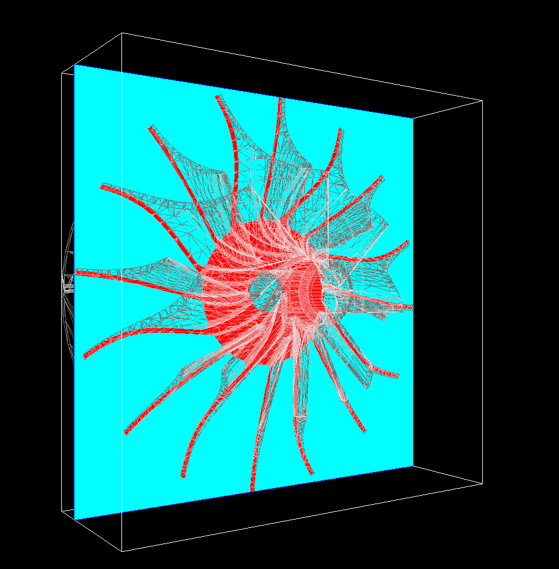

# 3DSlicer

## The purpose of this program is to produce slices of a triangular model using OpenGL
library. It uses OpenCSG for boolean operations. Because OpenGL is run on GPU, slices
is both efficient and reliable using this approach.

## Example:
An sample model "radial.off" is provided in the distribution. After compiling the software
giving the command "./csg model.off 1000 1000 1" will produce the following image. 

